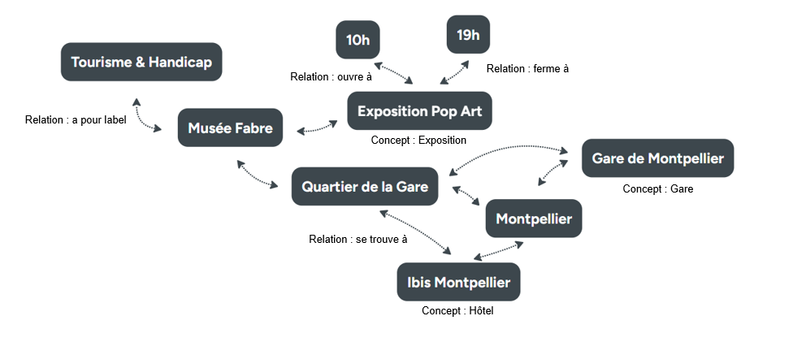

# Rapport préliminaire - Itinéraire de voyage

*Rédaction : Thomas BOULAIS*

Le projet est la **création d’une application web** qui permet de proposer à l’utilisateur **un itinéraire de voyage optimisé** à partir de contraintes renseignées comme la durée ou l’endroit désiré.

L’objectif de ce document est d’avoir un **premier contact avec le sujet** au travers des sources de données à notre disposition. Une fois analysées, l’émergence des **lacunes actuelles** devrait permettre de définir la ou les **problématiques métiers** auxquels la mise en place d’une **plateforme de données** est une solution adéquate. Après une brêve synthèse des parties précédentes, nous concluerons sous forme d'ouverture en direction des **opportunités Produit** potentielles pour l’application à développer.

## Lexique
- **POI(s)** : Points d’intérêt (*Point Of Interest*)
- **OSM** : OpenStreetMap
- **DT** : DATAtourisme
- **RDB** : base de données relationnelles
- **ODbL** : contrat de licence favorisant l’utilisation des données (Open Database Licence)

## 1. Analyse exploratoire des flux de données

### 1.1. Identifier les sources de départ

Notre point de départ est de découvrir et étudier les sources de données à notre disposition. Après une brève description de chacune d’entre elles, nous verrons leur structure de données, identifierons les étapes de transformation nécessaires à leur interopérabilité et présenterons la nouvelle base de données prête à être consommée par l’application cible.  

L'étude des données dans le cas d’itinéraires de voyage concentre notre attention autour de champs issus des familles suivantes :
- **Nom** : le nom du POI ;

- **Localisation** : coordonnées géographiques du POI, direct ou via géométrie ;
- **Catégories** : catégorie du POI (culturel, restauration, etc.) avec sous-catégorie plue détaillée (musée ou lieu historique pour un type culturel par exemple) ;
- **Périodes & horaires d’ouverture** : permet de savoir quand un POI est visitable ou pas ;
- **Informations générales** : contact email et téléphonique,  description & caractéristiques du POI.

#### 1.1.a. DATAtourisme

**DATAtourisme** est une plateforme nationale pour les données d’offres touristiques en territoire français. En agrégeant, normalisant, qualifiant et diffusant en open data les données institutionnelles d’information touristiques, **ses objectifs sont de faciliter l’accès aux données publiques, valoriser l’offre touristique des territoires et favoriser la création de services innovants**.  

La donnée, sous format `JSON-LD`, est récupérable via le site https://diffuseur.datatourisme.fr en associant la création d’un flux (*webservice*) avec la clef API associée à l’application. Sa structure est articulée en **modèle sémantique**: chaque **élément**, **propriété**, **relation** et **contrainte** est stockée de telle sorte que **leur définition soit explicite**, contrairement aux *RDB* où la clef étrangère d’une table n’a de sens qu’avec une interpolation ou explication fonctionnelle de celle-ci.

<center></center>
<center><i>figure 1: schéma d’un fragment du modèle sémantique DATAtourisme</i></center><br>

Accompagnée de son **ontologie** (https://www.datatourisme.fr/ontology/core) l’exploration de la donnée nous apprend que les POIs (*Points Of Interests*) sont répartis en 4 types de POI (lieu, fête et manifestation, produit, itinéraire touristique), avec un grand nombre de tags métiers présents ou pas selon le type et les sous-types des POIs.  

**Localisation**  
La localisation spatiale, enregistrée dans le champ `isLocatedAt`, peut être exprimée de 2 manières: selon un schéma `geo` avec *longitude/latitude* ou selon un schéma `address` avec la structure complète *adresse/départmement/région/pays*.

**Catégories**  
Chaque POI est catégorisé par une ou plusieurs catégories spécifiques que nous appellerons `sous-types` parmi plus de 180 possibilités pouvant être regroupé par `type` selon leur nature. 

*Par exemple, les tags :* 
- *`Theater` et `Cinema` pourront être des **`sous-types`** associés au **`type`** `leisure & entertainment`,*
- *tandis que `BrasserieOrTavern`, `StreetFood`, `GourmetRestaurant` ou `Bakery` appartiendront plutôt au **`type`** `restauration`*

<br>

**Période & Horaires d'ouverture**  
Pour la gestion des horaires d’activité un schéma structuré existe, on remarque cependant qu’une partie des points de données observés renseigne ces informations dans le tag `additionalInformation` à la place pour renseigner textuellement les horaires.  

En conclusion la présence d'un nombre bien plus élevé de possibilités de type dans DATAtourisme ainsi que sa structure sémantique donne à cette source une forte valeur métier. La présence d'itinéraires et de fêtes & manifestations renforce le but de la source d'être consommée par des acteurs du monde touristique.

#### 1.1.b. OpenStreetMap

**OpenStreetMap** (*OSM*) est une source mise en place par la fondation *OpenStreetMap* dont les données sont issues de **production participative** avant d’être mise à disposition sous licence **ODbL** (*Open Database Licence*, contrat licence favorisant la libre circulation des données). Ces données couvrent les données publiques d’une **majorité de la planète** et sont utilisées dans de multiples secteurs et activités, tels que : **navigation** (cyclisme, transport public, randonnée, ski, ferroviaire), **météo**, **cours d’eau**, **surveillance**, **infrastructures énergétiques et de communication**, etc.  

La libraire python `OSMnx` permet de télécharger, modéliser, analyser et visualiser des caractéristiques géographiques et réseaux de routes OSM. La donnée est récupérée en format `GeoParquet`, une version du modèle de données orientée colonnes Parquet définie spécifiquement pour stocker des données spatiales.  

Ses 405 colonnes contiennent une myriade d’informations dont plus de la moyenne booléennes (206) pour des informations comme `toilets:access`, `drink:espresso`, `payment:cash` ou `ruins`.  

**Localisation**  
La localisation est aussi stockée de 2 manières différentes : 
- via **Géolocalisation** avec un champ contenant soit `POINT()`, `POLYGON()` ou `LINESTRING()` qui représentent différentes géométries (point, polygone et ligne respectivement)
- via **Adresse** avec 12 colonnes qui démarrent par `addr:` comme  `addr:city`, `addr:housenumber`, `addr:postcode`, `addr:street`.

<br>

**Catégories**  
Les catégories sont exprimées par 2 champs ne prennant qu'une valeur unique et exprimant respectivement le type et si le POI possède une utilité pratique : 
- **`tourism`**, 6 possiblités:  `viewpoint`, `attraction`, `museum` `hotel`, `information`, `hostel`
- **`amenity`**, 9 possibilités : `restaurant`, `cafe`, `bar`, `arts_centre`, `place_of_worship`, `fountain`, `planetarium`, `reception_desk`, `animal_boarding`

<br>

**Périodes & horaires d’ouverture**  
Les horaires et périodes d'ouverture sont renseignées dans un champ `opening_hours` suivant la même structure comme indiqué dans l'exemple suivant : `Jul-Aug Tu-Fr 11:00-19:00; Jul-Aug Sa,Su 13:00-19:00; Sep-Jun Tu-Fr 10:00-18:00; Sep-Jun Sa,Su 13:00-18:00`  

**Réseaux de routes**  
En plus des données de POIs, la source OSM possède les informations concernant les **réseaux de routes** (piétons, automobiles) qui serviront à créer l'itinéraire. Ces données sont stockées au format `GraphML` et dont chaque entrée représente un **noeud** (`node`) ou une **arrête** (`edge`).  

Malgré un détail métier plus réservé que **DATAtourisme**, la possibilité d'itinéraire grâce aux réseaux de routes pointe qu'**OpenStreetMap** a une forte direction vers des propduits/sujets autour de la navigation.  

En conclusion les 2 sources comportent les données utiles pour les besoins de l'application, et leurs champs sont suffisamment similaires pour être harmonisés. 

### 1.2. Identifier les transformations & interactions

Comme vu dans le bloc précédent, les sources présentent des similitudes, cependant leurs disparités sur plusieurs aspects induisent le besoin de les transformer afin d’obtenir une base de données harmonisée, prête à l’emploi pour l’application.  

*Par exemple, la disparité de profonfeur entre les données type etsous-type de POIs montrent une nécessité de mettre en place un socle commun sur lesquels les POIs peuvent coexister.*  

*Les géométries des POIs OSM peuvent être transformés pour ne conserver que la position moyenne (le centroïde) de chaque point d'intérêt.*  

*Les horaires sont stockés sous des formats différents, et leur format actuel représente une contrainte trop complexe pour être ingérée afin d'entraîner un modèle.*  

*Un même POI dans chacune des sources peut avoir une orthographe différente. Une approche se basant sur la proximité de géoloc des POIs semble plus appropriée.*  

En suivant l’architecture médaillon, les étapes sont les suivantes : 

**POIs**  
```
OSM : Source ➡️ Bronze ➡️ Silver ↘️
					  				Gold
DT  : Source ➡️ Bronze ➡️ Silver ↗️
```

**ROAD NETWORKS**
```
OSM : 	Source ➡️ Bronze ➡️ Silver ➡️ Gold
```

<br>

Les étapes de transformation, de nettoyage, d'harmonisation et solutions présentées sont autant de frictions qu'un utilisateur doit traverser s'il souhaite produire un itinéraire se basant sur les informations métiers plus pointues de **DATAtourisme** avec les routes d'**OpenStreetMap**, ou avec les POIs des 2 sources.

## 2. Problématiques métier
### 2.1. Constat

L'analyse des sources de données montrent que chacune des sources enrichit l'autre : 
- pour les **POIs OSM**,le manque d'informations métiers plus précises et le besoin d'uniformiser les géométries
- pour **DATAtourisme**, l'absence de routes pour accéder aux autres POIs

Et bien que les 2 sources existent, l'incapacité actuelle à les fusionner dynamiquement signifie que l’user est contraint d’effectuer un travail de modélisation manuelle chronophage.  

En considérant ces contraintes, **le calcul de l'itinéraire optimisé n'est pas possible en l'état**.

### 2.2. Analyse des services souhaités

A partir de ce constat, on peut établir les problématiques suivantes : 

```
Comment mettre en place un système de génération d'itinéraires optimisés de voyage, basé sur des données touristiques précises ? 

Quel type d'apprentissage est le plus adapté à la génération d'itinéraires à partir de POIs et de contraintes (temporelles, de préférences utilisateurs) ?
```

La réponse à la première question est **la mise en place d'une nouvelle architecture de données**, dont l'organisation permettra l'entraînement d'un modèle de Deep Learning adapté à notre sujet.  

La réponse à la 2e question tient à l'approche mathématique qu'on peut aposer à ce problème. Dans ce cas, avec pour **noeuds** les POIs et pour **arrêtes** les routes entre les POIs, le problème peut être posé dans un contexte de théorie des graphe comme **un problème de maximisation de profit avec des contraintes temporelles sur le transport et la disponibilité des noeuds**.  

La nouvelle plateforme devra prendre en compte le besoin d'intéraction entre les noeuds et leurs voisins pour l'entraînement d'un modèle. 

Ci-dessous un premier jet proposant de manière détaillée les étapes de l'architecture médaillon pour les POIs et les réseaux de routes :

 | Type | Etape | Source | Action(s) | Format en sortie
 | :-: | :-- | :-: | :-- | :--
 | **POIs** | **Source > Bronze** | **`OSM`** | *1. requêtage API filtré sur la zone d'étude (Hérault)<br>2. stockage GeoParquet en format brut* | `GeoParquet` <br>+ `CSV` pour contrôle
 | **POIs** | **Source > Bronze** | **`DT`** | *1. requêtage API filtré sur la zone d'étude (Hérault)<br>2. Récupération & extraction du dump<br>3. stockage & extraction du dump en dossier `JSON`*  | 1 `JSON` par entrée <br>+ `JSON` des index
 | **POIs** | **Bronze > Silver** | **`OSM`** | *1. enrichissement/suppression NaNs<br>2. transformation géométries en point centroïdes<br>3. filtre sur colonnes pertinentes* | `GeoParquet` <br>+ `CSV` pour contrôle
 | **POIs** | **Bronze > Silver** | **`DT`** | *1. parsing JSON en GeoParquet<br>2. enrichissement/suppression NaNs<br>3. suppression doublons* | `GeoParquet` <br>+ `CSV` pour contrôle
 | **POIs** | **Silver > Gold** | **`OSM`** <br>& <br>**`DT`** | *1. normalisation champs catégories <br>2. création masque horaires <br>3. merge des 2 sources <br>4. détection & suppression doublons* | `GeoParquet` <br>+ `CSV` pour contrôle
 | **Road <br>Networks** | **Source > Bronze** | **`OSM`** | *1. requêtage API sur la zone d'étude (Hérault)<br>2. ajout vitesse & temps de voyage* | `GraphML`
 | **Road <br>Networks** | **Bronze > Silver** | **`OSM`** | *-* | `GraphML`
 | **Road <br>Networks** | **Silver > Gold** | **`OSM`** | *création d'un `CSV` liant chaque POI à ses voisins les plus proches* | `GraphML` <br>+ `CSV` pour **Model training**


En observant les étapes de nettoyage et d'harmonisation à réaliser en vue d'une ingestion dans une application web avec apprentissage d'un modèle, les différences les plus marquées ressortent, résumées ci-dessous :

 | Objet concerné | DATAtourisme | OpenStreetMap | Solution
 | :-: | :-: | :-: | :-:
 | **catégories** | liste cumulée | choix unique dans 2 champs | création d'une ontologie et d'une structure commune
 | **périodes & horaires d'ouverture** | différence de format | différence de format | création d'une liste booléenne représentant chaque minute ouverte d'une semaine <br>+ stockage périodes d'ouverture
 | **durée d'une visite** | n'existe pas | n'existe pas | création & ajout d'une durée standard selon type de POI


Ces réflexions sont d'autant de prérequis et contraintes à considérer lors de la création de l'architecture de données à destination de notre application web.

## 3. Synthèse de l’existant & Opportunité de développement

Dans le cas de la génération d'itinéraires optimisés de voyage avec de données touristiques qualitatives, les sources de données DATAtourisme et OpenStreetMap présentent chacune des avantages significatifs.  

Cependant les données sont trop hétérogènes en l'état pour permettre un calcul d'itinéraire optimisé sans intervention humaine.  

Une opportunité de développer une couche autour de ces données apparaît sous la forme d'une nouvelle architecture de données harmonisant les 2 sources initiales et prête à être ingérée par l'application web. 
