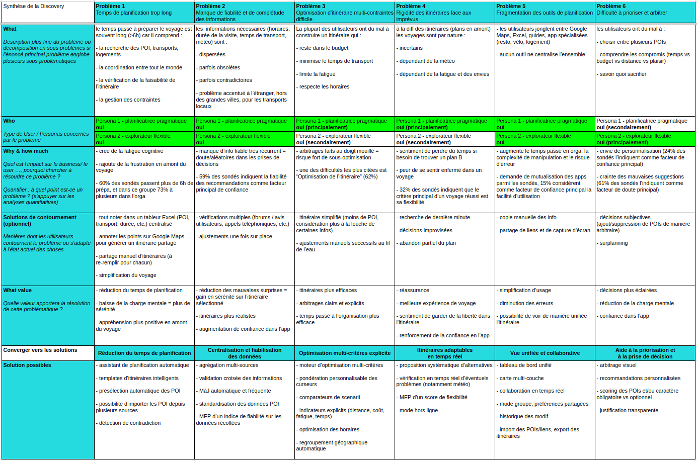

# Cahier des Charges - Itinéraire de voyage

*Rédaction : Thomas BOULAIS*

## Plan du cahier des charges

1. **Phase Discovery**  
*phase de recherche et découverte des besoins à partir de framework de réflexions*  

    1. **Récolte du besoin**  
    *questionnaire auprès de futurs potentiels usagers*  

    2. **Création des Personas**  
    *à partir des résultats du questionnaire*  

    3. **Synthèse Discovery**  
    *idéation autour des problématiques*  

    4. **Experience Map**  
    *idéation du parcours utilisateur à partir des personas*

2. **Périmètre du projet**  
*à partir de l'ensemble des opportunités produit réfléchies plus tôt, on va sélectionner de quoi constituer le MVP pour la V1*  

    1. **Liste de toutes les fonctionalités**  
    *rappel des opportunités & solutions des synthèse Discovery & Experience Map*  

    2. **Tri des priorités**  
    *Méthode MoSCoW must-have / should-have / could-have / won't-have*  

    3. **Définition du MVP**  
    *prise de décision sur le périmètre du MVP*  

---
---

# 1. Phase Discovery

L'objectif de la partie Discovery est de poser les problèmes auxquels on souahite répondre et de le confronter à la réalité via **enquête**, puis de reformuler les problèmes sur lesquels on souhaite agir en définissant des **personas**.  

A ces fins, des documents de cadrages tels que la **Synthèse Discovery** ou l'**Experience Map** sont très utiles en se plaçant dans différentes approches autour du sujet, respectivement la **résolution de problèmes** (le pragmatisme) et **le parcours utilisateur** (l'empathie).

## 1.1 Récolte du besoin

Afin d'avoir une idée générale du public susceptible d'être intéressé par une application de génération d'itinéraire optimisé de voyage, un **questionnaire d'enquête** a été créé et diffusé autour de nous : https://forms.gle/LLqZ1e3ZRSYHQNLJA  

Les 34 réponses ont permis de mettre en évidence les informations suivantes : 
- Les **¾** ont **entre 25 et 34 ans**, et plus d’**⅕** à **plus de 35 ans** pour des **voyages en groupe** (au moins 2)
- Plus des **¾** planifient **à plusieurs**
- Plus des **¾** utilisent soit des **app** soit des **tableurs**, et **15%** en **papier avec des guides touristiques**
- Les principales difficultés rencontrées sont l'**optimisation de l’itinéraire (62%)**, les **activités adaptés (47%)**, la **gestion des imprévus (30%)** et enfin le **manque d’info fiables (24%)**
- **60%** ont le **sentiment d’avoir déjà perdu du temps** pendant un voyage, à cause notamment d’une **mauvaise organisation (48%)**, de **temps de transport trop longs (19%)** ou d’un **temps d’attente entre les activités trop longues (14%)**
- Concernant le temps d’organisation, **60%** des sondés passent **plus de 6h avant de partir**, **21%** entre **4 et 6h** et moins pour le reste 
- Les critères les plus importants pour la planification sont le **budget (71%)**, la **distance entre les lieux (68%)**, le **temps de transport (65%)** et le **nombre de lieux à visiter (59%)**
- Parmi ceux qui utilisent une **app pour organiser leur voyage (68%)**, la vaste majorité utilise *Google Maps*, les autres utilisent *TripIt*, *My Maps*, *Stippl*, *Komoot*, *France Vélo Tourisme*, *Excel*, *Trip Advisor*.  
    - Ils indiquent manquer d'info dans ces app : transports publics disponibles, durée moyenne des activités et des transports, 
    - Ils indiquent aussi d'autres envies : mutualisation des app (activités, lieux, agendas, app trop spécialisée), avoir une option B, sortir des sentiers battus, avoir une garantie de la fiabilité des info
- **53%** des sondés considèrent qu’**un voyage est réussi si l’itinéraire est bien optimisé**, contre **32%** pour un **itinéraire flexible** 
- **91%** seraient **prêts à utiliser** une app d’optimisation d’itinéraire
- Les facteurs de confiance envers l’application sont la **fiabilité des recommandations (59%)**, la **personnalisation (24%)** et la **facilité d’utilisation (15%)**
- Les facteurs de doute sont les **erreurs dans les suggestions (61%)**, la **confusion dans les options proposées (21%)** et le **manque de flexibilité (15%)**

## 1.2. Création des Personas

Un **persona**, ou **archétype d'utilisateurs**, est un profil générique représentant la généralisation d'une partie de la population parmi ceux attendus comme utilisateurs finaux. Leurs *comportements*, *attentes*, *envies*, *besoins* et *contraintes* sont d'autant de **paramètres** qui sont **à considérer dans l'élaboration de la solution**.

A partir des réponses du questionnaire, les 2 personas suivants ont été défini : celui de la **Planificatrice pragmatique** et celui de l'**Explorateur flexible**.

 | Persona | Planificatrice pragmatique | Explorateur flexible
 | :-: | :-- | :--
 | **Profil** |  - 25-34 ans - duo ou petit groupe - à l’aise avec la tech - utilise Excel + Maps |  - 25-45 ans - solo ou duo - cherche des expériences authentiques - sensible aux opportunités, météo, fatigue
 | **Objectifs** |  - veut voir un max sans se fatiguer - veut respecter budget et horaires - veut des trajets optimisés | - veut sortir des sentiers battus  - veut garder de la liberté une fois sur place  - ne veut pas subir l’itinéraire
 | **Frustrations** |  - faire face aux imprévus  - manque d’info /info incomplètes  - outils manuels non connectés |  - itinéraire rigide  - lieux trop touristiques  - pas d’alternatives
 | **Attentes fonctionnelles** |  - optimisation auto de l’itinéraire  - ajustement dynamique en temps réel  - visualisation claire des compromis (distance vs budget vs temps) |  - recommandations s’adaptant à leurs goûts   - proposition d’itinéraire plus “beaux” ou “intéressants”  - scénarii alternatifs
 

## 1.3 Synthèse Discovery

Ce document de cadrage, proposé comme template par l'organisme de formation **DATASCIENTEST**, est un framework permettant d'identifier et de définir clairement les problèmes auxquels on souhaite répondre, les personas touchés ainsi que les impacts quantifiés, les solutions de contournement et opportunités pour notre application. 

<!--
 | Synthèse de la Discovery | **Problème 1** Temps de planification trop long | **Problème 2** Manque de fiabilité et de complétude des informations | **Problème 3** Optimisation d’itinéraire multi-contraintes difficile 
 | :-- | :-- | :-- | :-- 
 | **What**  *Description plus fine du problème ou décomposition en sous problèmes si l’énoncé principal problème englobe plusieurs sous problématiques* | le temps passé à préparer le voyage est souvent long (>6h) car il comprend :  - la recherche des POI, transports, logements - la coordination entre tout le monde - la vérification de la faisabilité de l’itinéraire - la gestion des contraintes | les  informations nécessaires (horaires, durée de la visite, temps de transport, météo) sont :   - dispersées - parfois obsolètes - parfois contradictoires - problème accentué à l’étranger, hors des grandes villes, pour les transports locaux | La plupart des utilisateurs ont du mal à construire un itinéraire qui :   - reste dans le budget  - minimise le temps de transport - limite la fatigue - respecte les horaires
 | **Who**  *Personas concernés par le problème Persona 1 - Planificatrice pragmatique Persona 2 - Explorateur flexible* | Persona 1 : **oui**  Persona 2 : **oui** | Persona 1 : **oui**  Persona 2 : **oui** | Persona 1 : **oui (principalement)**  Persona 2 : **oui (secondairement)** | 
 | **Why & how much**  *Quel est l’impact sur le business/ le user …, pourquoi chercher à résoudre ce problème ?  Quantifier : à quel point est-ce un problème ? (s’appuyer sur les analyses quantitatives)* | - crée de la fatigue cognitive   - rajoute de la frustration en amont du voyage  - 60% des sondés passent plus de 6h de prépa, et dans ce groupe 73% à plusieurs dans l’orga | - manque d’info fiable très récurrent = doute/aléatoires dans les prises de décisions  - 59% des sondés indiquent la fiabilité des recommandations comme facteur principal de confiance | - arbitrages faits au doigt mouillé = risque fort de sous-optimisation   - une des difficultés les plus citées est “Optimisation de l’itinéraire” (62%)
 | **Solutions de contournement (optionnel)**  *Manières dont les utilisateurs contournent le problème ou s'adapte à l'état actuel des choses* | - tout noter dans un tableur Excel (POI, transport, durée, etc.) centralisé - annoter les points sur Google Maps pour générer un itinéraire partagé  - partage manuel d’itinéraires (à re-remplir pour chacun)  - simplification du voyage | - vérifications multiples (forums / avis utilisateurs, appels téléphoniques, etc.)  - ajustements une fois sur place | - itinéraire simplifié (moins de POI, considération plus à la louche de certaines infos)  - ajustements manuels successifs au fil de l’eau
 | **What value**  *Quelle valeur apportera la résolution de cette problématique ?* | - réduction du temps de planification  - baisse de la charge mentale = plus de sérénité  - appréhension plus positive en amont du voyage | - réduction des mauvaises surprises = gain en sérénité sur l’itinéraire sélectionné   - itinéraires plus réalistes  - augmentation de confiance dans l’app | - itinéraires plus efficaces  - arbitrages clairs et explicits  - temps passé à l’organisation plus efficace
 | **Converger vers les solutions** | **Réduction du temps de planification** | **Centralisation et fiabilisation des données** | **Optimisation multi-critères explicite**
 | **Solution possibles** | - assistant de planification automatique  - templates d’itinéraires intelligents  - présélection automatique des POI  - possibilité d’importer les POI depuis plusieurs sources  - détection de contradiction | - agrégation multi-sources  - validation croisée des informations  - MàJ automatique et fréquente    - standardisation des données POI  - MEP d’un indice de fiabilité sur les données récoltées | - moteur d’optimisation multi-critères  - pondération personnalisable des curseurs  - comparateurs de scenarii  - indicateurs explicits (distance, coût, fatigue, temps)  - optimisation des horaires  - regroupement géographique automatique
-->

 

bsr mde