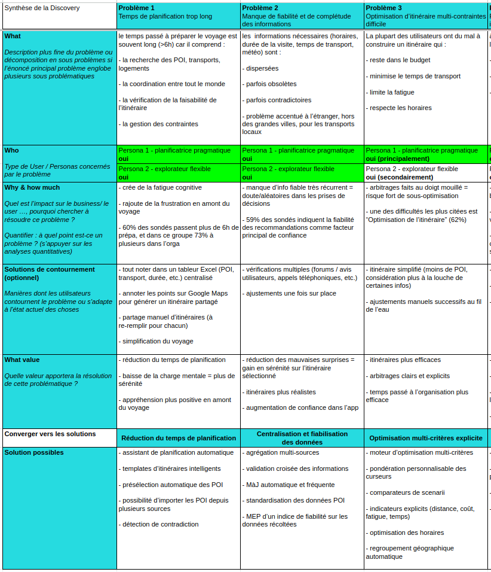
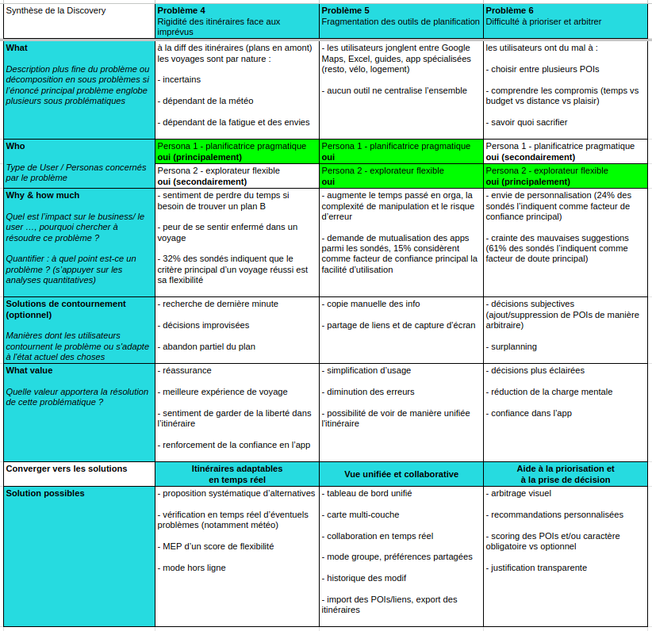
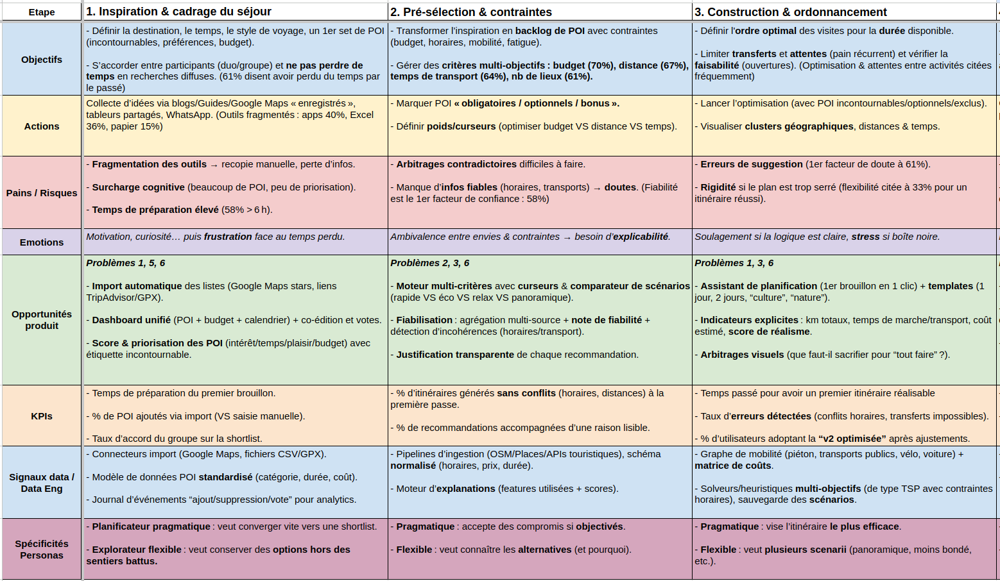
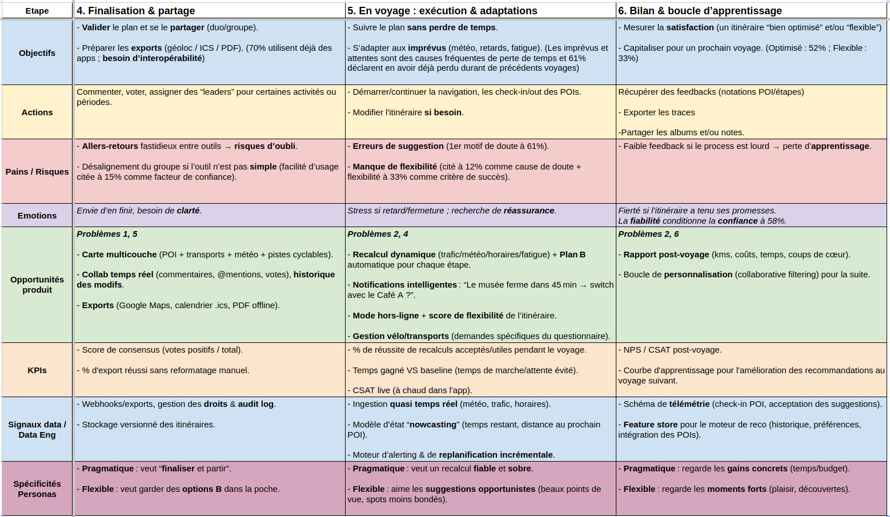

# Cahier des Charges - Itinéraire de voyage

*Rédaction : Thomas BOULAIS*

# 1. Phase Discovery

L'objectif de la partie Discovery est de poser les problèmes auxquels on souahite répondre et de le confronter à la réalité via **enquête**, puis de reformuler les problèmes sur lesquels on souhaite agir en définissant des **personas**.  

A ces fins, des documents de cadrages tels que la **Synthèse Discovery** ou l'**Experience Map** sont très utiles en se plaçant dans différentes approches autour du sujet, respectivement la **résolution de problèmes** (le pragmatisme) et **le parcours utilisateur** (l'empathie).

## 1.1 Récolte du besoin

Afin d'avoir une idée générale du public susceptible d'être intéressé par une application de génération d'itinéraire optimisé de voyage, un **questionnaire d'enquête** a été créé et diffusé autour de nous : https://forms.gle/LLqZ1e3ZRSYHQNLJA  

Les 34 réponses ont permis de mettre en évidence les informations suivantes : 
- Les **¾** ont **entre 25 et 34 ans**, et plus d’**⅕** à **plus de 35 ans** pour des **voyages en groupe** (au moins 2)
- Plus des **¾** planifient **à plusieurs**
- Plus des **¾** utilisent soit des **app** soit des **tableurs**, et **15%** en **papier avec des guides touristiques**
- Les principales difficultés rencontrées sont l'**optimisation de l’itinéraire (62%)**, les **activités adaptés (47%)**, la **gestion des imprévus (30%)** et enfin le **manque d’info fiables (24%)**
- **60%** ont le **sentiment d’avoir déjà perdu du temps** pendant un voyage, à cause notamment d’une **mauvaise organisation (48%)**, de **temps de transport trop longs (19%)** ou d’un **temps d’attente entre les activités trop longues (14%)**
- Concernant le temps d’organisation, **60%** des sondés passent **plus de 6h avant de partir**, **21%** entre **4 et 6h** et moins pour le reste 
- Les critères les plus importants pour la planification sont le **budget (71%)**, la **distance entre les lieux (68%)**, le **temps de transport (65%)** et le **nombre de lieux à visiter (59%)**
- Parmi ceux qui utilisent une **app pour organiser leur voyage (68%)**, la vaste majorité utilise *Google Maps*, les autres utilisent *TripIt*, *My Maps*, *Stippl*, *Komoot*, *France Vélo Tourisme*, *Excel*, *Trip Advisor*.  
    - Ils indiquent manquer d'info dans ces app : transports publics disponibles, durée moyenne des activités et des transports, 
    - Ils indiquent aussi d'autres envies : mutualisation des app (activités, lieux, agendas, app trop spécialisée), avoir une option B, sortir des sentiers battus, avoir une garantie de la fiabilité des info
- **53%** des sondés considèrent qu’**un voyage est réussi si l’itinéraire est bien optimisé**, contre **32%** pour un **itinéraire flexible** 
- **91%** seraient **prêts à utiliser** une app d’optimisation d’itinéraire
- Les facteurs de confiance envers l’application sont la **fiabilité des recommandations (59%)**, la **personnalisation (24%)** et la **facilité d’utilisation (15%)**
- Les facteurs de doute sont les **erreurs dans les suggestions (61%)**, la **confusion dans les options proposées (21%)** et le **manque de flexibilité (15%)**

## 1.2. Création des Personas

Un **persona**, ou **archétype d'utilisateurs**, est un profil générique représentant la généralisation d'une partie de la population parmi ceux attendus comme utilisateurs finaux. Leurs *comportements*, *attentes*, *envies*, *besoins* et *contraintes* sont d'autant de **paramètres** qui sont **à considérer dans l'élaboration de la solution**.

A partir des réponses du questionnaire, les 2 personas suivants ont été défini : celui de la **Planificatrice pragmatique** et celui de l'**Explorateur flexible**.

 | Persona | Planificatrice pragmatique | Explorateur flexible
 | :-: | :-- | :--
 | **Profil** |  - 25-34 ans - duo ou petit groupe - à l’aise avec la tech - utilise Excel + Maps |  - 25-45 ans - solo ou duo - cherche des expériences authentiques - sensible aux opportunités, météo, fatigue
 | **Objectifs** |  - veut voir un max sans se fatiguer - veut respecter budget et horaires - veut des trajets optimisés | - veut sortir des sentiers battus  - veut garder de la liberté une fois sur place  - ne veut pas subir l’itinéraire
 | **Frustrations** |  - faire face aux imprévus  - manque d’info /info incomplètes  - outils manuels non connectés |  - itinéraire rigide  - lieux trop touristiques  - pas d’alternatives
 | **Attentes fonctionnelles** |  - optimisation auto de l’itinéraire  - ajustement dynamique en temps réel  - visualisation claire des compromis (distance vs budget vs temps) |  - recommandations s’adaptant à leurs goûts   - proposition d’itinéraire plus “beaux” ou “intéressants”  - scénarii alternatifs
 

## 1.3 Synthèse Discovery

Ce document de cadrage, proposé comme template par l'organisme de formation **DATASCIENTEST**, est un framework permettant d'identifier et de définir clairement les problèmes auxquels on souhaite répondre, les personas touchés ainsi que les impacts quantifiés, les solutions de contournement et opportunités pour notre application. 

<i>figure 1: Synthèse Discovery 1/2 </i>
 

<i>figure 2: Synthèse Discovery 2/2 </i>

## 1.4 Experience Map

L'**Experience Map** est un document de cadrage suivant le parcours entier d'un utilisateur dans sa réalisation d'un objectif. **Il permet de réfléchir l'application par le prisme de l'empathie** en définissant les objectifs et actions, points de douleur & émotions, **pour en dégager des observations et opportunités produit**.

<i>figure 3: Experience Map 1/2 </i>
 

<i>figure 4: Experience Map 2/2 </i>

# 2. Périmètre du projet

Avec la liste des solutions possibles et opportunités Produit déterminées précédemment, nous avons une **base solide sur laquelle baser l'orientation du produit et définir explicitement le périmètre du MVP à présenter**.  

La présence ou non des fonctionnalités sera basée sur plusieurs critères tels que la *valeur ajoutée auprès d'utilisateurs finaux*, la *complexité à implémenter*, ou les *coûts/blocages technologiques*. Chaque arbitrage sera documenté.

## 2.1 Classement des fonctionnalités

L'ensemble des fonctionnalités précédemment identifiées peuvent être regroupée par bloc.

 | Bloc fonctionnel | Fonctionnalités constituantes | Besoins couverts | KPIs clés | Dépendance Data Eng
 | :-- | :-- | :-- | :-- | :--
 | **Import & Gestion des POIs** | - Import multi-sources (Google Maps, TripAdvisor, GPX, CSV) - Standardisation/normalisation des données POI - Scoring & priorisation des POIs (étiquetage incontournable vs optionnel) - Détection de contradictions (horaires, catégories) | 1, 5, 6 | - % POIs via import vs saisie manuelle - % itinéraires sans conflits à J1 | - Connecteurs + schéma POI standardisé-  - Pipeline d'ingestion OSM/DT - Moteur de détection d'incohérences
 | **Planification assistée** | - 1ère version en 1 clic - Templates intelligents (format 1j, 2j, thème) - Moteur d'optimisation multi-critères (rapide/éco/relax/panoramique) - Indicateurs explicites (km, temps marche/transport, coûts) - Comparateur de scénarios - Arbitrage visuel (trade-offs) | 1, 3, 6 | - Temps pour 1er itinéraire réalisable - % utilisateurs adoptant la v2 optimisée - % recommandations avec justification lisible | - Graphe de mobilité multi-modes - Modèle Deep Learning entraîné  - Moteur d'explications des prises de décisions
 | **Collaboration & Vue unifiée** | - Dashboard unifié (POIs + budget + calendrier) - Carte multi-couche (POIs, transports, météo) - Collaboration temps réel (commentaires, mentions, votes) - Historique des modifications - Mode groupe avec préférences partagées - Gestion des droits & audit log | 5, 6 | - Score de consensus (votes positifs/total) - % export réussi sans reformatage | - Webhooks/exports - Stockage versionné - Journal d'événements
 | **Fiabilité & Validation des données** | - Agrégation multi-sources - Validation croisée & Indice de fiabilité - Mise à jour auto fréquente - Détection de contradictions (horaires, transferts impossibles) | 2, 3 | - % itinéraires générés sans conflits J1 - Taux d'erreurs détectées | - Pipeline temps réel - Schéma normalisé horaires/prix/durée - Moteur de détection d'incohérences
 | **Adaptabilité en temps réel** | - Recalcul dynamique (trafic, météo, horaires, fatigue) - Proposition systématique d'alternatives (choix) - Plan B automatique par étape (imprévu) - Notifications intelligentes (alertes contextualisées) - Mode hors-ligne - Score de flexibilité de l'itinéraire - Gestion spécialisée vélo/transports | 4, 1 | - % réussite des recalculs acceptés/utiles - Temps gagné VS baseline - CSAT live | - Ingestion quasi temps réel - Modèle d'état "Nowcasting" - Moteur d'alerte & replanification incrémentale
 | **Apprentissage & Boucle post-voyage** | - Rapport post-voyage (kms, coûts, temps, coups de cœur) - Filtre personnel & collaboratif pour customisation - Boucle d'apprentissage des préférences | 6 | - NPS/CSAT post-voyage - Courbe d'apprentissage pour V+1 | - Schéma de télémétrie - Feature store

Une analyse par bloc de chacune des fonctionnalités constituantes nous permettra d'avoir un regard exhaustif concernant l'**Impact**, l'**Effort** et les éventuels **Blocages technologiques**.

### 2.1.1. Bloc 1 : Import & Gestion des POIs

 | Fonctionnalité | Impact | Effort | Blocage technologique | Justification
 | :-- | :-- | :-- | :-- | :--
 | **Connecteurs import (Google Maps, GPX, CSV)** | 3 | 3 | Oui : Nécessite de reverse-engineer les APIs disponibles, ou de web-scrap pour les sources fermées | Utile pour rajouter de nouveaux POIs personnels. Effort modéré mais dépend des partenariats (Google Maps API, TripAdvisor)
 | **Standardisation/normalisation des données POI** | 5 | 4 | Oui : Dépend directement de la qualité des sources et de la couverture des champs (horaires, prix, durée, catégories) | **Essentiel, c'est la fondation de l'app**. Si mal fait, tout le reste du produit génère des déchets. Effort élevé : ETL + data cleaning + schéma versionné
 | **Scoring & priorisation des POIs** | 4 | 2 | Non | Relativement simple une fois que les POIs sont standardisés. Une formule de score personnalisable mais basique suffit pour le MVP. Impact conséquent car c'est l'interface entre la donnée brute et la décision utilisateur
 | **Détection de contradictions** | 3 | 3 | Non | Important pour la fiabilité (cf. Besoin 2) mais pas critique au lancement. Les contradictions ne peuvent être  détectées que si les données sont bonnes ET standardisées (cf. fonctionnalité au-dessus)

**Synthèse Bloc 1** : 2 bloqueurs technologiques, au niveau des connecteurs et de la standardisation. La standardisation est impérative et doit être réalisée en premier.

### 2.1.2. Bloc 2 : Planification assistée

 | Fonctionnalité | Impact | Effort | Blocage technologique | Justification
 | :-- | :-- | :-- | :-- | :--
 | **1ère version en 1 clic** | 5 | 4 | Oui : Dépend d'un modèle Deep Learning opérationnel (même basique) + graphe de mobilité | **C'est la promesse du produit**, qui repose sur le bloc 1 ET sur un moteur d'optimisation fonctionnel. Effort conséquent : implémentation & entraînement d'un modèle sur problème de type TSP
 | **Templates intelligents** | 3 | 2 | Non | Nice-to-have. Simple à faire (quelques JSON avec des itinéraires tout-faits). Impact moyen :  accélère les utilisateurs non-techno mais pas fondamental
 | **Moteur multi-critères (rapide/éco/relax/panoramique)** | 5 | 5 | Oui : Nécessite un modèle multi-critères avec matrice de coûts fiable (temps, distance, coûts) et graphe de mobilité | **C'est le cœur du produit**. Effort très coûteux avec recherche/entraînement/optimisation. Une V1 simplifiée pourra être envisagée
 | **Indicateurs explicites (km, temps, coûts, réalisme)** | 4 | 2 | Non | Facile si considéré dans le modèle entraîné. Impact fort : crée de la confiance dans les recommandations. Dépend du bloc 1 (données fiables)
 | Comparateur de scénarios | 4 | 2 | Non | UI/UX sur les résultats du modèle. Peut-être simple mais implique que le modèle fasse plusieurs scénarios. Impact moyen/fort : fonctionnalité attendue pour persona explorateur
 | **Arbitrage visuel (trade-offs)** | 3 | 3 | Non | Dataviz + UI interactive. Modérément complexe côté front, impact moyen : aide à la prise de décision mais pas critique si les indicateurs sont lisibles

**Synthèse Bloc 2** : 2 gros bloqueurs, la 1ère version en 1 clic et le moteur multi-critères. Le modèle est la dépendance centrale. On démarrera avec une version simplifiée du modèle.

### 2.1.3. Bloc 3 : Collaboration & Vue unifiée

 | Fonctionnalité | Impact | Effort | Blocage technologique | Justification
 | :-- | :-- | :-- | :-- | :--
 | **Dashboard unifié (POI + budget + calendrier)** | 4 | 3 | Non | Dépend des données POIs et des calculs de budget/temps (bloc 1+2). UI/UX complexe mais pas de blocage techno. Impact fort : c'est comment les utilisateurs perçoivent le voyage
 | **Carte multi-couche** | 3 | 4 | Oui : Nécessite des APIs de cartographie (Mapbox, Google Maps) + Intégration météo/trafic en temps réel | Très coûteux techniquement (multi-source, perf). Impact moyen : "beau" ou "cool" mais pas critique pour fonctionner
 | **Collaboration temps réel (commentaires, mentions, votes)** | 4 | 4 | Oui : Nécessite WebSocket & BDD en temps réel (Firebase, Postgres avec abonnement) + gestion des conflits de concurrence | Impact fort = proposition de valeur clef pour les groupes. Mais coûteux en infra et bugs de sync. Peut être dégradé à "refresh manuel" en V1
 | **Historique des modifications** | 2 | 2 | Non | Facile si versionnement des données (audit log). Impact faible mais "Must-have" légale et UX (Ctrl+Z)
 | **Mode groupe avec préférences partagées** | 3 | 2 | Non | Logique métier simple de paramètres partagés. Dépend de la capacité du modèle à supporter l'organisation des contraintes groupes
 | **Gestion des droits & audit log** | 2 | 2 | Non | Standard (RBAC basique). Facile mais souvent oublié et non-critique, important pour la fiabilité de la collaboration

**Synthèse Bloc 3** : 2 bloqueurs, la carte multi-couche et la collab temps réel, tous deux coûteux. Une stratégie pour la V1 serait de démarrer avec un dashboard + mode groupe basique, une possibilité de collaboration en "refresh manuel" (pas besoin de WebSocket), et une seule couche de carte.

### 2.1.4. Bloc 4 : Fiabilité & Validation des données

 | Fonctionnalité | Impact | Effort | Blocage technologique | Justification
 | :-- | :-- | :-- | :-- | :--
 | **Agrégation multi-sources** | 4 | 3 | Oui : Nécessite d'avoir plusieurs sources connectées (bloc 1) + règles de fusion de données | Impact fort : c'est de cette manière que la donnée gagne en fiabilité, en supposant une base multi-sources
 | **Validation croisée** | 3 | 3 | Oui : Nécessite des règles métier pour détecter les contradictions et 3+ sources pour éviter les égalités | Modérément coûteux. Impact moyen : améliore la confiance mais n'est pas critique si on démarrer avec moins de sources
 | **Indice de fiabilité** | 3 | 2 | Non | Facile si agrégation de sources. Impact moyen : donne de la transparence à l'utilisateur
 | **Mise à jour auto fréquente** | 2 | 2 | Oui : Nécessite une infrastructure d'ingestion en temps réel (webhooks ou scheduled jobs) | Impact faible en V1. Un batch quotidien peut suffire au lieu de temps réel. Dépend de l'infra
 | **Détection de contradictions (horaires, transferts impossibles)** | 4 | 4 | Oui : Nécessite l'explicabilité du modèle + vérification logique (ex: "transfert bus-musée en 5 min" dans quartier X ?) | Impact fort : évite les itinéraires non-réalisables. Coûteux mais critique pour la crédibilité du produit

**Synthèse Bloc 4** : 3 bloqueurs légers, entre l'agrégation, la validation et la détection. Tous dépendent de la qualité des données. Pour le MVP, on pourra rester sur une détection basique des horaires impossibles sans passer par une validation croisée.

### 2.1.5. Bloc 5 : Adaptabilité en temps réel

 | Fonctionnalité | Impact | Effort | Blocage technologique | Justification
 | :-- | :-- | :-- | :-- | :--
 | **Recalcul dynamique (trafic, météo, horaires, fatigue)** | 4 | 5 | Oui : Nécessite une ingestion temps réel + un modèle "Nowcasting" + un moteur de replanification incrémentale | Triple combo hautement complexe. Impact fort pendant le voyage mais le MVP peut survivre sans. Vu le coût, à sortir de la V1
 | **Proposition d'alternatives** | 3 | 3 | Non | UI pour montrer les Plan B. Simple si le moteur les calcule. Dépend du bloc 2 (modèle).
 | **Plan B automatique par étape** | 3 | 3 | Oui : Nécessite de  stocker N itinéraires vs un unique, en rajoutant la logique de "basculement intelligente" | Modérément coûteux. Impact moyen : utile mais pas critique si l'utilisateur peut modifier l'itinéraire manuellement
 | **Notifications intelligentes** | 2 | 4 | Oui : Nécessite websocket + règles de push (ex: "Le musée ferme dans 45 min") + traitement en temps réel | Impact faible en V1, mais très coûteux. A sortir de la V1
 | **Mode hors-ligne** | 2 | 4 | Oui : Nécessite la  gestion du cache, la synchro incrémentale, et la résolution des conflits après reconnexion | Impact faible assez niche et très coûteux. A sortir de la V1
 | **Score de flexibilité** | 2 | 2 | Non | Simple métrique pour garder la trace des alternatives/plan B. Impact faible ; "curiosity feature"
 | **Gestion spécialisée vélo/transports** | 3 | 3 | Oui : Nécessite des APIs spécialisées (routage vélo distinct, GTFS pour transports) + graphe dédié | Impact moyen : le besoin existe et a été exprimé. Dépend de la disponibilité des APIs. A voir en V1.1

**Synthèse Bloc 5** : Ce bloc est un bourbier de bonnes idées très coûteuses qui n'ont pas leur place dans la V1. Parmi l'ensemble on peut ne garder que la proposition d'alternative sur un format basique.

### 2.1.6. Bloc 6 : Apprentissage & Boucle post-voyage

 | Fonctionnalité | Impact | Effort | Blocage technologique | Justification
 | :-- | :-- | :-- | :-- | :--
 | **Rapport post-voyage** | 2 | 2 | Non | Simple agrégation des métriques du voyage. Impact faible = Nice-to-have pour jouer sur la nostalgie et les sentiments. A sa place dans la V1.1
 | **Collaborative filtering** | 2 | 5 | Oui : Nécessite d'avoir une infra de Machine Learning infra avec la Feature store et le pipeline d'apprentissage | Impact moyen long-terme : améliore les reco au voyage suivant, mais très coûteux. N'a pas sa place dans la V1
 | **Boucle d'apprentissage des préférences** | 2 | 4 | Oui : Nécessite une télémétrie fine (check-in, acceptation des suggestions) + une boucle de retour | Impact moyen pour un coût élevé. A sortir de la V1

**Synthèse Bloc 6** : L'utilisation de ML/apprentissage pour améliorer les recommandation est trop coûteux pour la V1. On peut se cantoner à garder le rapport (cosmétique) et éventuellement des hooks télémétrie basiques en vue de préparer l'arrivée du ML dans la V2.

## 2.2. Synthèse globale : Matrice d'arbitrage pour le MVP

En suivant la méthode **MoSCoW** (***MUST-HAVE, SHOULD-HAVE, COULD-HAVE, WON'T-HAVE***), voici le résultat de l'arbitrage : 

 | Priorité | Fonctionnalités | Impact | Effort | Blocage technologique | Recommendation
 | :-- | :-- | :-- | :-- | :-- | :--
 | MUST-HAVE | Standardisation POI | 5 | 4 | Oui | Fondation de tout, à réaliser en premier
 |  | Moteur multi-critères (basique) | 5 | 5 | Oui | Coeur du produit, à réaliser mais en version "lite" (1 seul mode pour démarrer)
  |  | 1ère version en 1 clic | 5 | 4 | Oui | Promesse du produit, à réaliser une fois le moteur multi-critère implémenté
 |  | Dashboard unifié | 4 | 3 | Non | Comment les gens visualisent le périple en dehors de la carte. Nécessaire
 |  | Scoring & priorisation POI | 4 | 2 | Non | Facile à mettre en place, valeur forte
 |  | Indicateurs explicites | 4 | 2 | Non | Crée de la clarté et de la confiance auprès des utilisateurs
 | SHOULD-HAVE | Détection de contradictions | 4 | 3 | Oui | Important pour la crédibilité. A inclure si on a le temps
 |  | Mode groupe + préférences partagées | 3 | 2 | Non | Important pour un gain élevé en UX pour les groupes
 |  | Historique des modifications | 2 | 2 | Non | Important pour le caractère légal et l'UX
 |  | Gestion droits & audit log | 2 | 2 | Non | Standard, relativement facile à réaliser
 |  | Gestion spécialisée vélo/transports | 3 | 3 | Oui | À considérer.Impact moyen, coûteux, et dépend si des APIs sont dispo. A peut-être plus sa place en V1.1
 | COULD-HAVE | Comparateur scénarios | 3 | 2
 |  | Connecteurs import | 5 | 3 | Oui | 
 |  | (...)

Les autres fonctionnalités n'ont pas leur place dans la V1, comme exposé dans les tableaux précédents. En raison de la taille réduite de l'équipe projet, les fonctionnalités COULD-HAVE et WON'T HAVE ne sont pas explicitées pour le MVP.